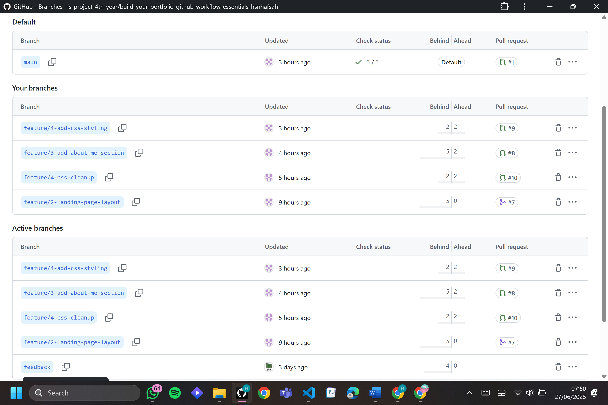

# Personal Portfolio Documentation

## 1. Student Details

- **Full Name**: Netiah Hafsah Siti
- **GitHub Username**: hsnhafsah
- **Email**: hsnhafsah@gmail.com

## 2. Deployed Portfolio Link

- **GitHub Pages URL**: 
https://is-project-4th-year.github.io/build-your-portfolio-github-workflow-essentials-hsnhafsah/
  
 
## 3. Learnings from the Git Crash Program

List at least **four key concepts or skills** you learned during the Git crash course. For each one, write a brief explanation of how it helped you manage your portfolio project more effectively.

1. **Branching**: Helped me separate different features of the website, such as the landing page and About Me section. This made it easier to work on each part independently and prevented merge conflicts when collaborating or merging changes back into the main branch.

2. **Commit Messages**: I learned how to write meaningful and structured commit messages using conventional formats like feat, fix, and style. This improved the clarity and history of my project, making it easier to track what each change did.

3. **Pull Requests**: Creating a pull request for each feature allowed me to review and manage changes more cleanly before merging them. I also learned how to simulate and resolve merge conflicts during this process.

4. **Interactive Rebase & Undoing Mistakes**: I learned how to use tools like git rebase -i and git reset to undo or clean up my commits. This was especially helpful when I accidentally pushed unwanted changes or needed to refine my commit history for a clearer PR.

## 4. Screenshots of Key GitHub Features

### A. Milestones and Issues

  
*A screenshot showing the milestone created for project planning and tracking.*

  
*An overview of all issues created and their statuses.*

  
*Specific issue created for designing the landing page.*

  
*Issue describing tasks related to adding CSS styling.*

  
*Issue describing the creation of the About Me section.*

### B. Project Board

  
*Shows issues in the "To Do" column on the GitHub Project Board.*

  
*Displays completed issues moved to the "Done" column.*

### C. Branching

  
*A screenshot showing the list of feature branches with meaningful names.*

### D. Pull Requests

  
*A screenshot of an open pull request linked to a related issue.*

  
*A screenshot showing a closed pull request after successful review and merge.*

### E. Merge Conflict Resolution

  
*A screenshot showing the detected merge conflict in the code.*

  
*The conflict being resolved using the merge editor in VS Code.*

  
*Final state after resolving the merge conflict successfully.*

